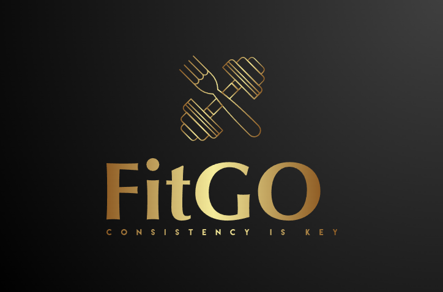
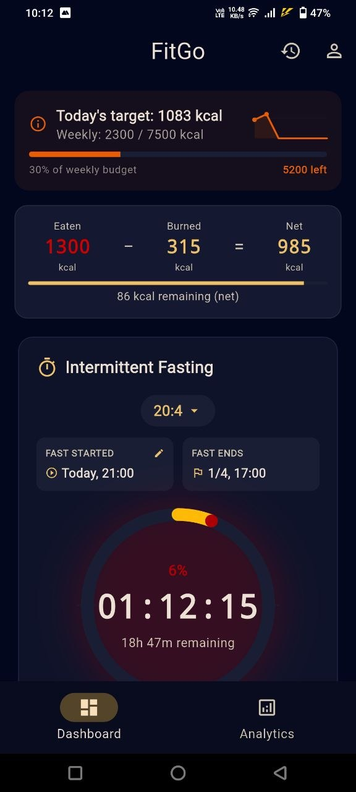
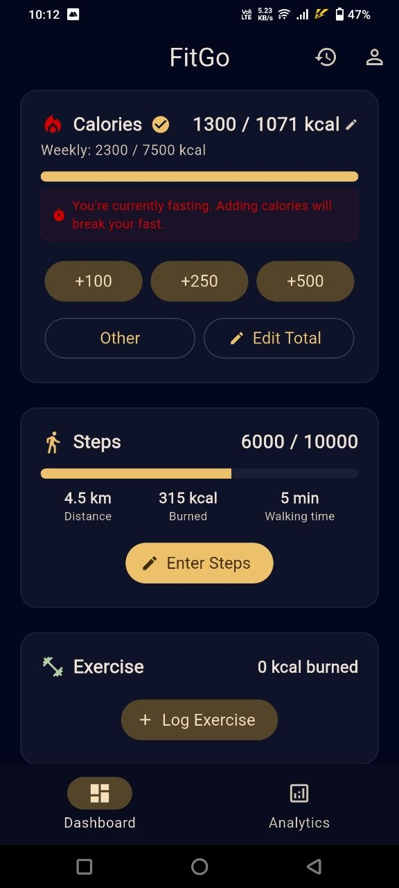
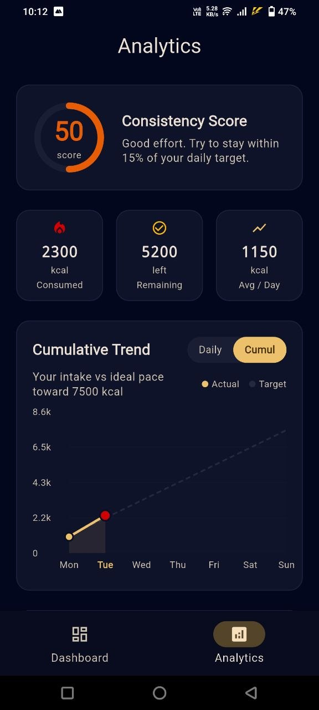
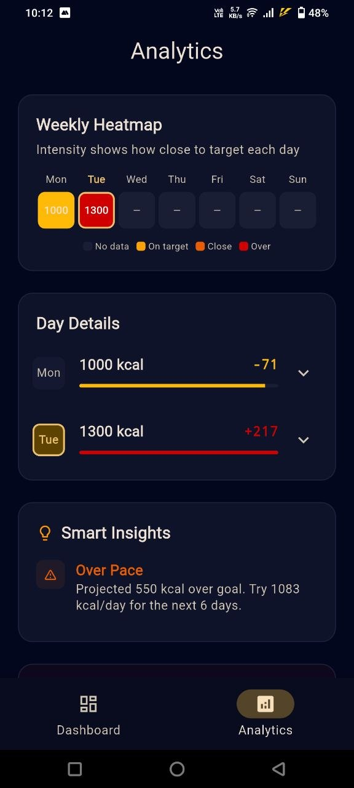
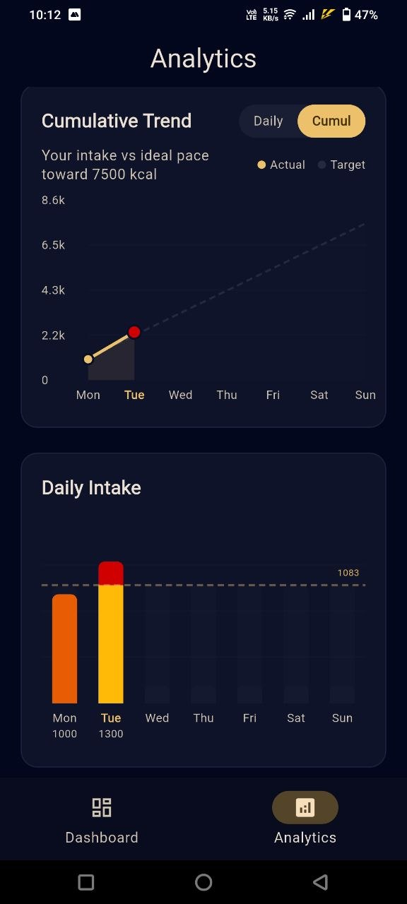
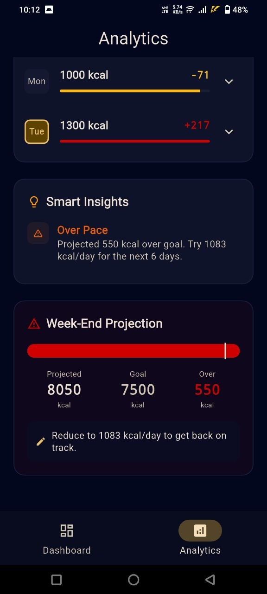

<p align="center">
  
</p>

<h1 align="center">FitGo — Your Path to Fitness</h1>

<p align="center">
  A comprehensive, offline-first fitness tracking app built with Flutter. Track calories, fasting, water intake, exercise, sleep, and weight — all with smart weekly budget management and advanced analytics.
</p>

<p align="center">
  <a href="https://flutter.dev"></a>
  <a href="#"></a>
  <a href="#"></a>
  <a href="#"></a>
</p>

---

## 📱 App Previews

<p align="center">
   &nbsp;
   &nbsp;
   &nbsp;
  
</p>

<br>

<p align="center">
   &nbsp;
  
</p>

---

## 🚀 Features

### 🥗 Calorie Management
- **Weekly Calorie Budget** — Set a weekly target (e.g., 7500 kcal/week), app auto-calculates daily quota
- **Smart Redistribution** — Eat less today? Tomorrow's allowance increases automatically
- **Quick Add Buttons** — +100, +250, +500 kcal with one tap, or enter custom amounts
- **Net Calories** — `Eaten - Burned = Net` — the number that actually matters

### ⏳ Intermittent Fasting Timer
- **Radial Dial** — Beautiful red-to-amber gradient that fills as your fast progresses
- **Timestamp Delta** — Survives app kills, restarts, and OS battery optimization
- **Flexible Presets** — 16:8, 18:6, 20:4
- **Overtime Counter** — Shows how long you've fasted past your goal

### 🏃‍♂️ Activity Tracking
- **Step Counter** — Auto-calculates calories burned and distance
- **Exercise Logger** — 12 preset activities (Running, Cycling, Gym, Yoga, HIIT, Swimming, etc.) with MET-based calorie burn calculations
- **Sleep Tracker** — Log bedtime & wake time, quality indicator, 8h target tracking

### 💧 Water & ⚖️ Weight Tracker
- **Quick +250ml** button with glass indicators & dynamic goals based on body weight (~35ml per kg)
- **Manual weight logging** with trend chart & **BMI auto-calculation** with color-coded categories

### 📊 Advanced Analytics Dashboard (V2.0 Upgraded)
- **Consistency Score** — 0-100 ring showing how well you hit daily targets
- **Cumulative Trend & Daily Zigzag Chart** — Toggle between actual intake vs ideal pace (with **Dynamic Red Alerts** for target breaches)
- **Dynamic Stacked Bar Chart** — Color-coded bars (Yellow for safe, Red for excess limits)
- **Smart Insights Engine** — Auto-generated tips: streak detection, hydration checks, budget advice

---

## ⚙️ Tech Stack

| Layer | Technology |
|---|---|
| **Framework** | Flutter (Dart) |
| **State Management** | Riverpod |
| **Local Storage** | Hive (Offline-First approach) |
| **Backend & Auth** | Supabase (PostgreSQL + Email/OAuth) |
| **Data Visualization**| fl_chart |

---

## 🧠 Key Design Decisions

- **Offline-First**: All data lives in Hive locally. App works perfectly without an active internet connection.
- **Timestamp Delta for Fasting**: Instead of running background timers (battery drain), we store `T_start_epoch` in Hive. `elapsed = DateTime.now() - T_start_epoch`. The OS can kill the app — time still passes.
- **Weekly Budget Redistribution**: Daily target = `(weekly_goal - calories_consumed_so_far) / remaining_days`. The math forces consistency.
- **MET-Based Exercise Calories**: Scientifically accurate metric for 12 activity types.

---

## 🛠️ Setup & Installation

### Prerequisites
- Flutter SDK (3.x+) & Dart SDK
- A Supabase project

### Running Locally
```bash
# Clone the repo
git clone https://github.com/YOUR_USERNAME/FitGo.git
cd FitGo

# Install dependencies
flutter pub get

# Generate Hive adapters
dart run build_runner build --delete-conflicting-outputs

# Generate Custom App Icons
dart run flutter_launcher_icons

# Run the app
flutter run
```

### Build APK
Generate a production-ready application binary:
```bash
flutter build apk --release
```
*APK output path:* `build/app/outputs/flutter-apk/app-release.apk`

---

## 🔬 Calorie Science

The app uses the **Mifflin-St Jeor** equation for BMR:
* **Male**: `BMR = 10 x weight(kg) + 6.25 x height(cm) - 5 x age + 5`
* **Female**: `BMR = 10 x weight(kg) + 6.25 x height(cm) - 5 x age - 161`

**TDEE** = BMR x 1.4 (sedentary multiplier)  
**Weight change rule**: ~7,700 kcal deficit = ~1 kg fat loss

---

<p align="center">
  Built with ❤️ using Flutter. Free to use, modify, and distribute under the MIT License.
</p>
